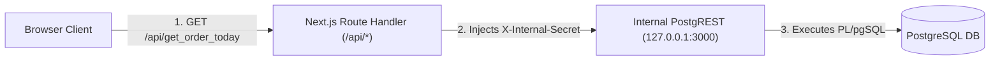

# Enterprise Operations Platform & Analytics Console

An enterprise-grade, high-performance operations console built with **Next.js 16 (App Router / Turbopack)**, **React 19**, **Recharts**, **Tailwind CSS**, and **TypeScript**.

Designed for seamless integration with **PostgreSQL**, **PostgREST**, and the **Addax / DataX ETL Engine**.

---

## 📁 Codebase Directory Structure & Architecture

```text
ReactNextLab/
├── .env                       # Environment Configuration (DEV / UAT / PRD)
├── .env.example               # Environment Configuration Template
├── README.md                  # Comprehensive Developer & Architecture Guide
├── SESSION_SUMMARY.md         # Historical Architectural Context & Handover Summary
├── messages/                  # i18n Localization Dictionaries
│   ├── zh-TW.json            # Primary / Default Locale (繁體中文)
│   ├── zh-CN.json            # Simplified Chinese (简体中文)
│   ├── en-US.json            # English
│   └── ja-JP.json            # Japanese (日本語)
│
├── src/
│   ├── app/                   # Next.js App Router
│   │   ├── api/               # Backend-for-Frontend (BFF) Server API Proxy Handlers
│   │   │   ├── get_order_today/   # GET /api/get_order_today -> PostgREST RPC
│   │   │   ├── kpi/pos-products/  # GET /api/kpi/pos-products -> PostgREST Table
│   │   │   └── etl/jobs/          # GET /api/etl/jobs -> Addax Pipeline Table
│   │   ├── layout.tsx        # Root Layout & Theme/I18n Context Providers
│   │   └── page.tsx          # Main Application View Controller
│   │
│   ├── components/            # View Components & Interactive Panels
│   │   ├── PosPerformancePage.tsx  # POS KPI Analytics & Dynamic Recharts
│   │   ├── DataXEtlPage.tsx        # Addax / DataX ETL Pipeline Console & Health
│   │   ├── RolePermissionsPage.tsx # RBAC Role & Access Control Matrix
│   │   ├── UserSettingsPage.tsx    # User Accounts & AD Integration Setup
│   │   ├── SystemPreferencesPage.tsx # Theme & Language Selector
│   │   ├── Header.tsx              # Top Application Navigation Bar
│   │   └── Sidebar.tsx             # 2-Level Nav Accordion & Active Env Badge
│   │
│   ├── context/               # Global React Context State
│   │   └── I18nContext.tsx       # Global i18n Locale Provider & Types
│   │
│   ├── data/                  # Initial Datasets & DEV Simulation Fallbacks
│   │   ├── pocData.ts            # POS, ETL Jobs, Roles, Users & Permissions
│   │   └── mockData.ts           # Telemetry & Request Log Mock Data
│   │
│   ├── lib/                   # Central Configuration & API Registries
│   │   ├── config.ts             # Centralized Multi-Environment (DEV/UAT/PRD) Config
│   │   └── apiMap.ts             # Central API Mapping Registry (/api/* -> Remote URLs)
│   │
│   ├── services/              # API Service Layer & DDL Specifications
│   │   ├── kpiService.ts         # POS Products API & PostgREST DDL Spec
│   │   ├── etlService.ts         # Addax Pipeline API & Database DDL Spec
│   │   ├── roleService.ts        # Role Permissions API & Schema DDL Spec
│   │   └── userService.ts        # User Account & AD Sync API Spec
│   │
│   ├── types/                 # TypeScript Data Models & Contracts
│   │   ├── poc.ts                # POS, ETL, Role, User, and Page Types
│   │   └── analytics.ts          # Metrics & Telemetry Log Models
│   │
│   └── utils/                 # Cross-Component Service Utilities
│       └── dateFormatter.ts      # Locale-Aware Date & Time Formatter
│
├── public/                    # Static Assets
└── next.config.ts             # Next.js Build Configuration
```

---

## 🔐 Backend-for-Frontend (BFF) & API Proxy Architecture

To protect internal **PostgREST** and **Addax ETL Engine** URLs/ports from direct browser exposure without requiring complex client-side JWT handling, all frontend requests pass through Next.js server-side API Route Handlers.



### Key Security Advantages:
1. **URL & Port Isolation**: Raw database table names and PostgREST ports remain bound exclusively to loopback (`127.0.0.1`) or private container networks.
2. **Server-Side Secret Injection**: Next.js route handlers automatically inject internal authorization headers (`X-Internal-Secret`).
3. **CORS Prevention**: All frontend fetch calls target same-origin relative URLs (`/api/*`).

---

## 🗺️ Centralized API Route Mapping Registry ([`src/lib/apiMap.ts`](file:///home/student_03_a8cc42dc8126/ReactNextLab/src/lib/apiMap.ts))

All local frontend API routes are mapped to their respective remote/internal backend endpoints in [`src/lib/apiMap.ts`](file:///home/student_03_a8cc42dc8126/ReactNextLab/src/lib/apiMap.ts):

| Local API Path | Remote Endpoint | Method | Description |
| :--- | :--- | :--- | :--- |
| `/api/get_order_today` | `/rpc/get_order_today` | `GET` | Fetches today's revenue and order metrics via PostgREST RPC |
| `/api/kpi/pos-products` | `/pos_products?select=*` | `GET` | Queries POS terminal fleet metrics sorted by revenue |
| `/api/etl/jobs` | `/etl_jobs?select=*` | `GET` | Retrieves configured Addax pipeline topology & status |
| `/api/etl/engine/health` | `/api/v1/etl/health` | `GET` | Heartbeat health probe for Addax worker cluster |

---

## 🔀 Multi-Environment (`DEV` / `UAT` / `PRD`) Capability

Environment configuration is managed via [`.env`](file:///home/student_03_a8cc42dc8126/ReactNextLab/.env) and programmatically resolved in [`src/lib/config.ts`](file:///home/student_03_a8cc42dc8126/ReactNextLab/src/lib/config.ts):

```env
# Active Profile Switcher: DEV | UAT | PRD
NEXT_PUBLIC_APP_ENV=DEV

# Toggle Live PostgreSQL/PostgREST Connection
ENABLE_LIVE_POSTGREST=false

# DEV Cluster
POSTGREST_DEV_URL=http://127.0.0.1:3000
ADDAX_DEV_URL=http://127.0.0.1:8080/api/v1/etl
INTERNAL_API_SECRET=dev-bff-secret-key-2026

# UAT (Staging) Cluster
POSTGREST_UAT_URL=http://uat-db.corp.internal:3000
ADDAX_UAT_URL=http://uat-etl.corp.internal:8080/api/v1/etl
UAT_INTERNAL_SECRET=uat-bff-secret-key-2026

# PRD (Production) Cluster
POSTGREST_PRD_URL=http://prd-db.corp.internal:3000
ADDAX_PRD_URL=http://prd-etl.corp.internal:8080/api/v1/etl
PRD_INTERNAL_SECRET=prd-bff-secret-key-2026
```

---

## 🛠️ Developer Rules & Best Practices

1. **Separation of Concerns**:
   - **UI Views** ([`src/components/`](file:///home/student_03_a8cc42dc8126/ReactNextLab/src/components)): Focus purely on rendering layout, interaction, and Recharts.
   - **API Services** ([`src/services/`](file:///home/student_03_a8cc42dc8126/ReactNextLab/src/services)): Encapsulate async calls, DDL schemas, and data fetching logic.
   - **Data Models** ([`src/types/`](file:///home/student_03_a8cc42dc8126/ReactNextLab/src/types)): Maintain strict TypeScript interfaces.

2. **Internationalization (i18n)**:
   - Primary default locale is **`zh-TW`** (Traditional Chinese).
   - Use `useI18n()` hook for all UI text (`m.<category>.<key>`). Keep `messages/*.json` files in sync.

3. **Date & Time Formatting**:
   - Always use `dateFormatter` ([`src/utils/dateFormatter.ts`](file:///home/student_03_a8cc42dc8126/ReactNextLab/src/utils/dateFormatter.ts)) for user-facing timestamps and chart axes (`formatDateTime`, `formatChartDay`).

---

## 🚀 How to Run & Deploy

### Development Mode
```bash
npm run dev
```
Open [http://localhost:3000](http://localhost:3000) in your browser.

### Launching in Specific Environment
```bash
# Target UAT Cluster
NEXT_PUBLIC_APP_ENV=UAT npm run dev

# Target PRD Cluster
NEXT_PUBLIC_APP_ENV=PRD npm run dev
```

### Production Build & Execution
```bash
# 1. Build optimized bundle
npm run build

# 2. Start production server
npm run start
```

### API Endpoint Verification
```bash
curl -s http://localhost:3000/api/get_order_today
curl -s http://localhost:3000/api/kpi/pos-products
```
